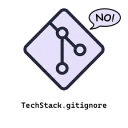

<h1 align="center">
  <a href="https://github.com/ptanmay143/techstack-gitignore">
    
  </a>
</h1>

<div align="center">
  techstack-gitignore
  <br />
  <a href="#about"><strong>Explore the features »</strong></a>
  <br />
  <br />
  <a href="https://github.com/ptanmay143/techstack-gitignore/issues/new?assignees=&labels=bug&title=bug%3A+">Report a Bug</a>
  ·
  <a href="https://github.com/ptanmay143/techstack-gitignore/issues/new?assignees=&labels=enhancement&title=feat%3A+">Request a Feature</a>
  .
  <a href="https://github.com/ptanmay143/techstack-gitignore/issues/new?assignees=&labels=question&title=support%3A+">Ask a Question</a>
</div>

<div align="center">
<br />

[](LICENSE)
[](https://github.com/ptanmay143/techstack-gitignore/issues?q=is%3Aissue+is%3Aopen+label%3A%22help+wanted%22)
[](https://github.com/ptanmay143)

</div>

<details open="open">
<summary>Table of Contents</summary>

- [About](#about)
  - [Built With](#built-with)
- [Getting Started](#getting-started)
  - [Prerequisites](#prerequisites)
  - [Installation](#installation)
- [Usage](#usage)
- [Roadmap](#roadmap)
- [Support](#support)
- [Project Assistance](#project-assistance)
- [Contributing](#contributing)
- [Authors & Contributors](#authors--contributors)
- [Security](#security)
- [License](#license)
- [Acknowledgements](#acknowledgements)

</details>

---

## About

`techstack-gitignore` is an extension for Visual Studio Code that helps developers create and manage `.gitignore` files efficiently. Instead of manually copying and pasting ignore templates from various sources, this extension enables you to search, download, and combine ignore rules directly from within the editor. It solves the friction of bootstrapping a new repository and ensures your project's git configuration is correct from the start.

This extension is built for developers who regularly set up new repositories or manage multi-language work environments. It is designed to work seamlessly within both small individual workspaces and large multi-root enterprise workspaces, supporting offline operation via caching and configurable repositories for secure environments.

The project exists to provide a native, fast, and feature-rich interface to the massive library of templates available in the community. It bridges the gap between raw git configurations and the VS Code workflow, allowing developers to manage templates, preserve custom repository rules, and resolve conflicts dynamically without corrupting existing configs.

At a high level, the extension operates by querying the configured repository contents (defaulting to the official `github/gitignore` repo). It fetches directories of interest, loads template names, parses existing local ignore files to detect custom modifications, allows the user to multi-select templates via a QuickPick UI, and compiles the selected templates with local rules in a reproducible alphabetical order.

The main constraint to keep in mind is the GitHub API rate limiting. To mitigate this, the extension integrates persistent caching of templates and supports VS Code's GitHub authentication provider to perform authorized, higher-limit API requests if rate limits are reached.

<details>
<summary>Screenshots</summary>
<br>

This project has no graphical interface. See [Usage](#usage) for example editor interactions.

</details>

### Built With

- **TypeScript** — Primary language used to implement the extension's commands, network clients, and caching layers.
- **VS Code Extension API** — Exposes commands, workspace configuration access, authentication provider integration, and the QuickPick UI.
- **Node.js HTTPS/FS Modules** — Powers low-level HTTPS client requests and local file system manipulations (file streams, template compilation).
- **Esbuild** — High-performance packager used to bundle the extension source into a single file for release.

---

## Getting Started

Setting up the project locally for development or testing takes under 5 minutes. You will need to clone the repo, install Node modules, and run the esbuild build process.

### Prerequisites

- **Node.js >= 20.x** — [nodejs.org](https://nodejs.org). Node 20 LTS is recommended for building and packing the extension.
- **Visual Studio Code >= 1.66.0** — [code.visualstudio.com](https://code.visualstudio.com). The minimum supported IDE runtime environment for installing and testing the extension.

### Installation

1. Clone the repository:
   ```bash
   git clone https://github.com/ptanmay143/techstack-gitignore.git
   cd techstack-gitignore
   ```

2. Install the package dependencies:
   ```bash
   npm install
   ```

3. Build the extension:
   ```bash
   npm run compile
   ```

4. Verify the setup by opening the project folder in VS Code and pressing `F5` to start a new Extension Development Host window.

---

## Usage

### Commands

The primary way to use the extension is via the VS Code Command Palette:
1. Open the Command Palette (<kbd>Ctrl</kbd>+<kbd>Shift</kbd>+<kbd>P</kbd> or <kbd>F1</kbd>).
2. Start typing `Add gitignore` and press `Enter`.
3. Select the workspace folder (if using a multi-root workspace).
4. Select one or more `.gitignore` templates (e.g. `Node`, `Windows`, `macOS`) from the list.
5. Choose how to handle any existing unmanaged `.gitignore` file (Migrate, Backup & replace, or Overwrite).

### Extension Settings

You can customize the extension via your `settings.json`:

```json
{
  "gitignore.cacheExpirationInterval": 3600,
  "gitignore.defaultTemplates": ["windows", "linux", "macos"],
  "gitignore.downloadConcurrency": 6,
  "gitignore.backupSuffix": ".backup",
  "gitignore.githubApiBaseUrl": "https://api.github.com",
  "gitignore.githubRepository": "github/gitignore"
}
```

---

## Roadmap

Future developments focus on enhancing local proxy configuration handling and expanding fallback APIs.

- [Top Feature Requests](https://github.com/ptanmay143/techstack-gitignore/issues?q=label%3Aenhancement+is%3Aopen+sort%3Areactions-%2B1-desc)
- [Top Bugs](https://github.com/ptanmay143/techstack-gitignore/issues?q=is%3Aissue+is%3Aopen+label%3Abug+sort%3Areactions-%2B1-desc)

No formal roadmap has been documented yet. See the issue tracker for outstanding work.

---

## Support

Reach out to the maintainer at one of the following places:

- [GitHub Issues](https://github.com/ptanmay143/techstack-gitignore/issues)
- Email: ptanmay143@outlook.com

---

## Project Assistance

If you want to say **thank you** or support active development of techstack-gitignore:

- Add a [GitHub Star](https://github.com/ptanmay143/techstack-gitignore) to the project.
- Write about the project on your blog.

---

## Contributing

First off, thanks for taking the time to contribute! Contributions are what make the open-source community such an amazing place to learn, inspire, and create.

### Development Workflow

1. Fork the Project.
2. Create your Feature Branch (`git checkout -b feature/AmazingFeature`).
3. Commit your Changes using Conventional Commits (`git commit -m 'feat: add some AmazingFeature'`).
4. Push to the Branch (`git push origin feature/AmazingFeature`).
5. Open a Pull Request.

### Code Style & Linting
Ensure all code compiles and passes linter checks before submitting:
```bash
npm run compile
npm run lint
```

---

## Authors & Contributors

The original setup of this repository is by [Tanmay Pachpande](https://github.com/ptanmay143).

For a full list of all authors and contributors, see [the contributors page](https://github.com/ptanmay143/techstack-gitignore/contributors).

---

## Security

techstack-gitignore follows good practices of security, but 100% security cannot be assured. techstack-gitignore is provided **"as is"** without any **warranty**. Use at your own risk.

---

## License

This project is licensed under the **MIT License**.

See [LICENSE](LICENSE) for more information.

---

## Acknowledgements

- [github/gitignore](https://github.com/github/gitignore) for the comprehensive repository of `.gitignore` templates.
- Git logo by Jason Long (which the extension icon is based on).

<!-- Generated by README_GENERATOR_PROMPT v0.1 -->
